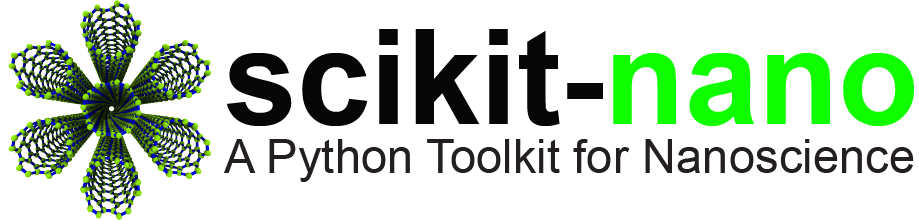

:tocdepth: 2

==========================
scikit-nano |version| docs
==========================

:Release: |release|
:Date: |today|

.. |logo_svg| image:: _static/scikit-nano_banner.svg

.. raw:: html

   

.. only:: latex

    .. image:: _static/scikit-nano_logo.pdf

Welcome to the scikit-nano documentation! scikit-nano is a Python package
intended for nanoscience.

.. _user-docs:

User Documentation
==================

.. toctree::
   :maxdepth: 1

   getting_started.rst

.. toctree::
   :maxdepth: 2

   tutorial/index.rst

.. toctree::
   :maxdepth: 1

   contribute.rst

.. toctree::
   :maxdepth: 1

   release.rst

.. _reference:

API Reference
=============

.. toctree::
   :maxdepth: 1

   apps.rst
   core.rst
   generators.rst
   io.rst
   scripts.rst
   testing.rst
   utils.rst

Indices and Tables
==================

* :ref:`genindex`
* :ref:`modindex`
* :ref:`search`

.. _versions:

Other versions
===============

.. ifconfig:: 'dev' in release

   |stable| `documentation <http://scikit-nano.org/doc>`_

.. ifconfig:: 'dev' not in release

   `scikit-nano development documentation <http://scikit-nano.org/doc/dev>`_
